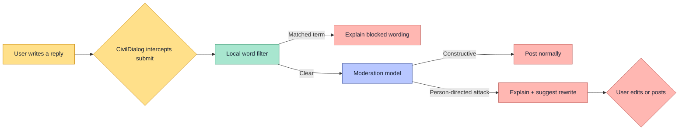
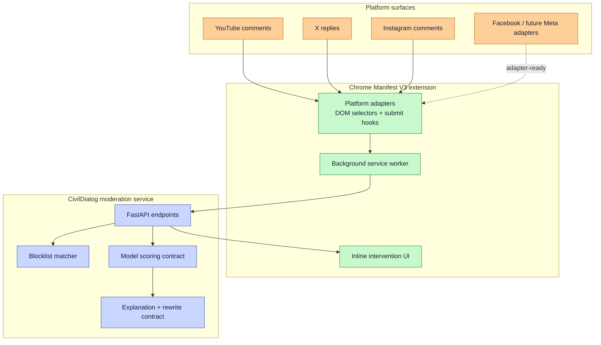

# TROLLGATE

### A calmer comment section, one reply at a time.

CivilDialog is a browser-based moderation layer that pauses harmful comments before they are posted. It distinguishes a disagreement with an idea from an attack on a person, explains the risk in plain language, and suggests a more constructive rewrite.

Built for a hackathon, designed as a real integration: a lightweight Chrome extension sits on top of a reusable platform-adapter layer, while a small FastAPI service owns moderation decisions and model orchestration.


## Why this is different

Most moderation tools either block keywords or remove content after the damage is done. CivilDialog works at the moment of intent, with a reversible intervention:

- **Context over keywords:** catches person-directed fallacies such as ad hominem attacks, not just banned words.
- **Explainable intervention:** tells the writer what to change instead of silently judging them.
- **Human-in-the-loop:** the writer keeps control of the final comment.
- **Privacy-aware boundary:** the extension talks only to the local service; credentials stay server-side.
- **Integration-first design:** platform-specific DOM logic is isolated in small adapters, making new surfaces cheap to add.

## Product flow



## Technical architecture



## Stack

| Layer | Technology | Purpose |
| --- | --- | --- |
| Browser integration | Chrome Manifest V3, JavaScript | Intercept comment submission without replacing the platform UI |
| Platform abstraction | Adapter pattern | Keep selectors and composer behavior isolated per platform |
| Service | Python, FastAPI, Pydantic | Validate requests and expose predictable moderation contracts |
| Moderation model | DistilBERT-class text classifier, trained and evaluated in this project | Score person-directed language and fallacy signals |
| Model packaging | ONNX-compatible inference boundary | Keep the model swappable and deployment-friendly |
| Data workflow | Python, scikit-learn, Hugging Face datasets | Prepare, split, balance, and evaluate labeled examples |
| Deployment | Docker Compose | Reproducible local service on loopback |

## Model evolution

This project has deliberately evolved in layers:

1. **Rule-based baseline:** a local blocklist and conservative phrase heuristic made the first demo reliable and easy to test.
2. **Trained classifier:** DistilBERT was fine-tuned on logical-fallacy data, evaluated, and exported behind a stable scoring interface.
3. **Production-shaped orchestration:** classification, explanation, rewrite generation, retries, validation, and fallback behavior now live behind one service contract.

The model is not treated as a black box. The team built the dataset preparation, moderation prompts/contracts, confidence handling, intervention UI, and platform integrations around it. That combination is the product: the model can improve without rewriting the extension.

## Built for the "USERS"

### Scope

- Live interception on YouTube, X replies, and Instagram comments
- Word-filter and fallacy-detection toggles
- Inline warning, explanation, matched terms, and suggested rewrite
- Local health check and Docker deployment
- Automated tests for dataset preparation and model-response parsing

### KEY POINTS(USP): 

**Problem:** online conversations reward escalation and punish nuance.

**Insight:** the best intervention happens before publishing, when rewriting is still easy.

**Build:** combine deterministic protection with model-based context detection and a respectful rewrite loop.

**Impact:** reduce personal attacks without pretending that disagreement itself is harmful.

## Integration path for Meta platforms

The integration boundary is intentionally small. Each platform supplies an adapter with four responsibilities: find the composer, read its text, identify its submit action, and observe dynamic content. The shared interception engine handles the rest.

Instagram is supported today. Facebook can be added through the same adapter contract without changing the moderation service, scoring format, or UI. This makes the architecture suitable for Meta's web surfaces while keeping platform selectors independently maintainable as DOMs change.

## Run locally

```bash
python3 -m venv .venv
. .venv/bin/activate
pip install -r requirements.txt

# Configure the server-side model credentials in your shell.
export AI_API_KEY="your-key"
python -m uvicorn server.main:app --host 127.0.0.1 --port 8787
```

Then load `extension/` from `chrome://extensions` with Developer mode enabled. The extension never stores the server credential.

Check the service:

```bash
curl http://127.0.0.1:8787/health
pytest -q
```

For Docker:

```bash
export AI_API_KEY="your-key"
docker compose up --build -d
```

## Repository map

```text
extension/          Chrome extension and platform adapters
server/             FastAPI service and moderation contracts
data/               Dataset download, preparation, and labeling tools
tests/              Python regression tests
models/             Trained artifacts and evaluation outputs
config/             Local moderation configuration
```

## Responsible-use notes

CivilDialog should assist reflection, not decide what opinions are acceptable. Confidence thresholds should be tuned against human-reviewed civil disagreement examples, and users should always be able to edit their wording themselves. Platform DOMs change, so browser integration tests remain part of the maintenance loop.

## License and data

See [LICENSE](LICENSE) and [DATA_SOURCES.md](DATA_SOURCES.md) for project and dataset details.
